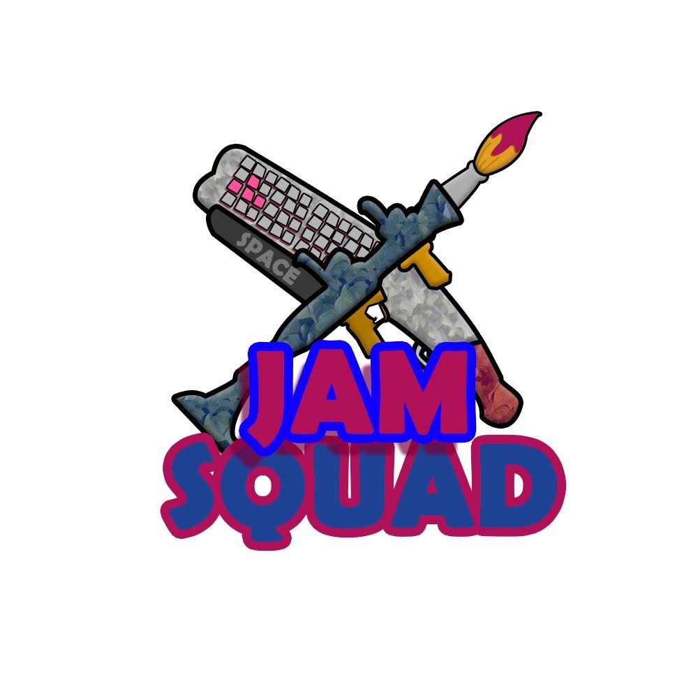
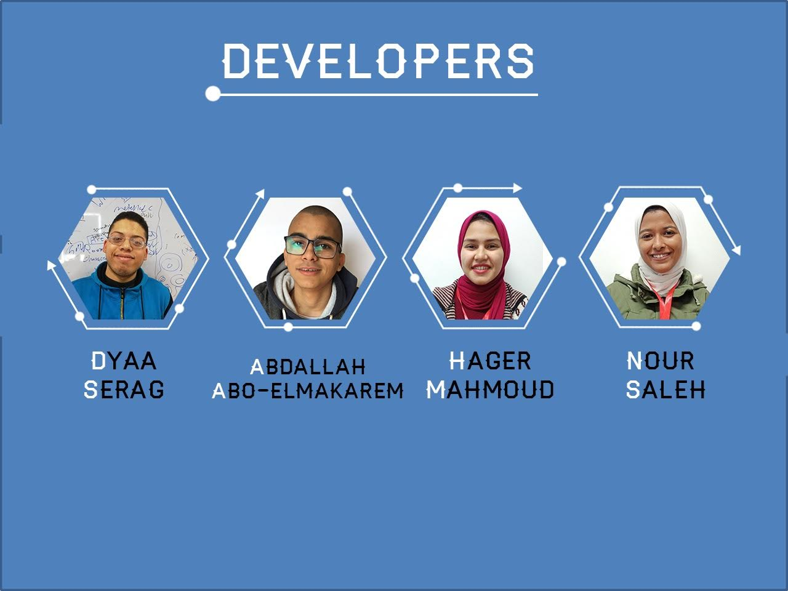
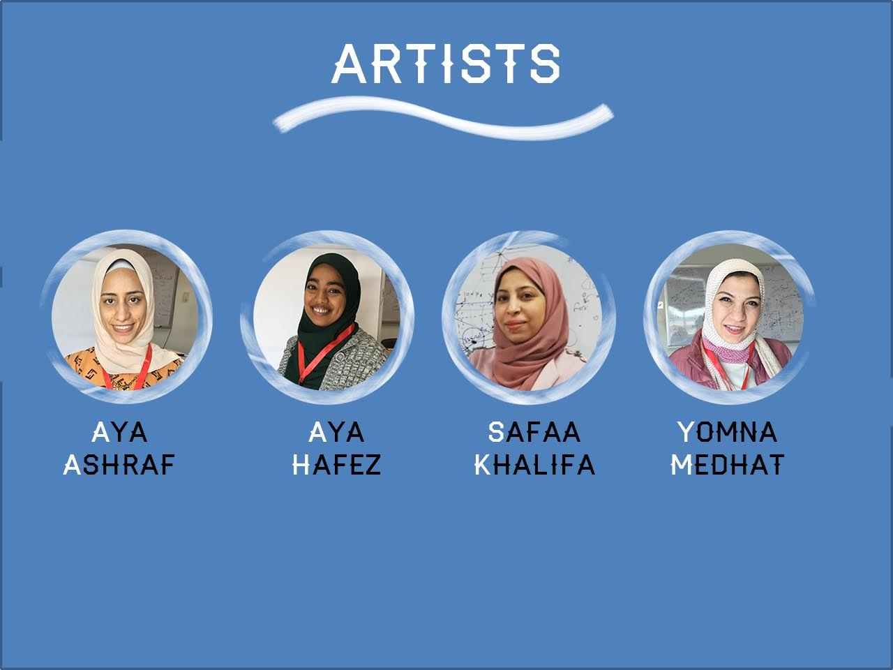
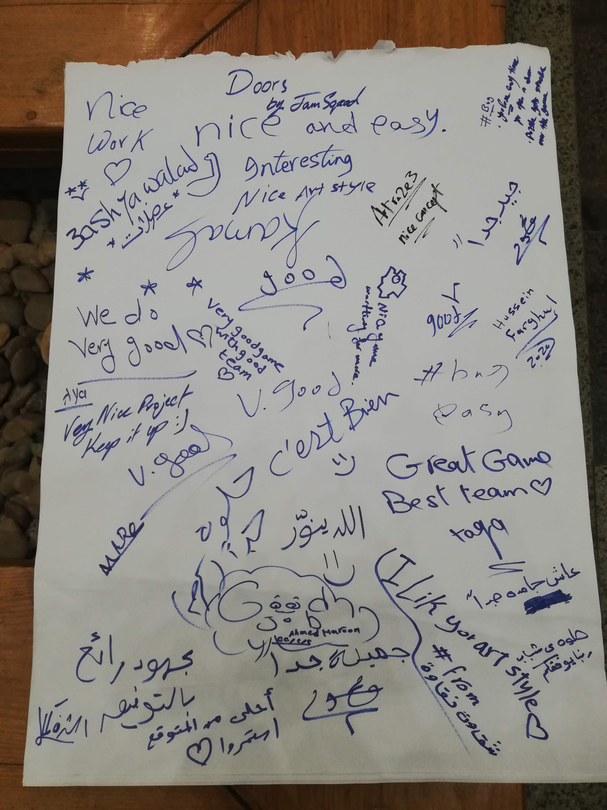

# Global Game Jam 2020 - Jam Squad - Doors

## Project Details
- **Event:** Global Game Jam 2020
- **Platform:** Unity
- **Showcase:** ITI
- **Language:** English
- **Team:** Designed and built by talented individuals contributing their unique assets and expertise

## Challenge Information
The Global Game Jam challenges participants to innovate and create games within a limited timeframe while adhering to a common theme. For our project, "Doors" became a metaphor for new opportunities and transitions in gameplay. Our team embraced the challenge by designing interactive puzzles and dynamic environments that not only reflected the theme but also pushed the boundaries of conventional game mechanics. Through creative problem-solving and collaborative effort, we turned limitations into a source of inspiration, delivering an engaging experience under intense time constraints.

## Demo Video
Watch the demonstration video:
[View Demo Video](game.mp4)

## Team

## Feedback

For more feedback and insights, visit:
[View on Facebook](https://www.facebook.com/share/p/18JZhFT4gs/)
